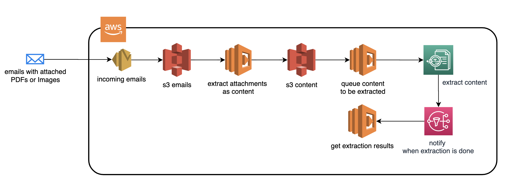

# Email App Content Recognition
This AWS Serverless Application was originally created to automatically read N number of emails (eml format) from an s3 bucket, download all attachments into another s3 bucket. These binary attachments (PDFs or images) need to be stored for own access. The Attachments then are processed and its content extracted through OCR algorithms. Due to the nature of this Serverless Architecture, this application has low costs and scales automatically.



## Dependencies
- cdk
- python
- aws-cli

## Setup
```
virtualenv .env && source .env/bin/activate && \
    python -m pip install -r requirements.aws.txt && \
    python -m pip install -r requirements.app.development.txt && \
    python -m pip install -r requirements.app.txt && \
```

## Deploy
```
exports AWS_ACCOUNT_ID=<UPDATE> 
exports AWS_DEFAULT_REGION=<UPDATE> 
exports EMAILS_S3_BUCKET=<UPDATE> 
exports CONTENT_S3_BUCKET=<UPDATE>

npm run deploy
```
